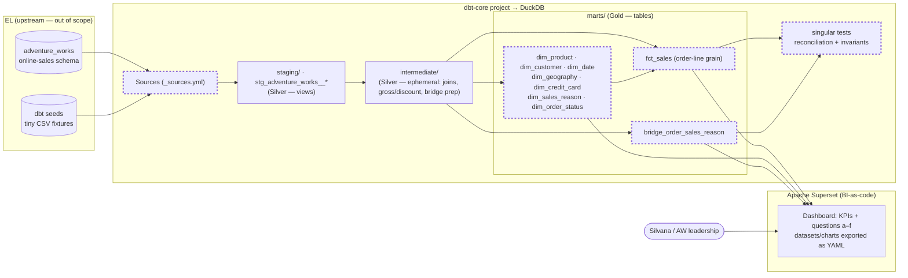
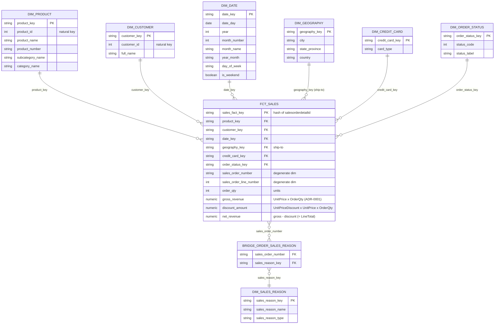

# ARCHITECTURE — AdventureWorks Analytics Engineering

> **VALIDATED (dev) — 2026-07-10.** Technical truth (how it's built). Referenced by `PRD.md`, not
> duplicated. A living document — update it when a decision closes; keep discarded alternatives.
> Closed decisions: [ADR-0001](adrs/0001-gross-sales-definition-and-reconciliation.md) …
> [ADR-0009](adrs/0009-medallion-via-dbt-layers.md) (index below).

## Overview
A dbt-core project transforms the raw `adventure_works` (online sales) schema into a conformed star
schema, materialized in a **local DuckDB** file and surfaced through an **Apache Superset** dashboard
(BI-as-code). Everything runs offline and reproducibly (`dbt build`) — the dominant constraint: a grader
re-runs the pipeline and reproduces every number, including the audited 2011 gross-sales figure.

Layering follows the dbt Style Guide with an explicit **medallion mapping** for governance
([ADR-0009](adrs/0009-medallion-via-dbt-layers.md)):

| Medallion | dbt layer | Materialization | Contents |
|---|---|---|---|
| **Bronze** (raw) | `sources` / seeds | — | `adventure_works` schema as-is; declared in `_sources.yml` |
| **Silver** (clean/conform) | `staging/` + `intermediate/` | views / ephemeral | `stg_adventure_works__*` (rename, cast, dedupe); joins, gross/discount logic, bridge prep |
| **Gold** (business-ready) | `marts/` | **tables** | `dim_*`, `bridge_order_sales_reason`, `fct_sales` |

### System diagram (container + seams)
Dashed borders = **seams** (where automated tests intercept behaviour).

### Star schema (dimensional model)
The Gold layer the build implements: `fct_sales` at order-line grain surrounded by seven conformed
dimensions, with the multi-valued sales reason reached through a bridge (ADR-0003) rather than a fact FK.
Surrogate `_key`s per [ADR-0007](adrs/0007-surrogate-keys.md); geography = ship-to
([ADR-0005](adrs/0005-geography-conformance-ship-to.md)). This diagram is the implementation contract for
Phases 2–3.

> Reason analysis joins `fct_sales → sales_order_number → bridge → dim_sales_reason`; the base fact carries
> **no** reason FK, so gross revenue never fans out (ADR-0003). A single-reason filter (e.g. "Promotion")
> is exact.

## Seams
Where behaviour is intercepted for testing — prefer existing, highest, fewest. Three seam groups, all
native dbt mechanisms; the green signal is `dbt build`.

1. **dbt sources** (`_sources.yml` over `adventure_works`) — `source:*` schema tests: presence, expected
   columns, not-null on keys, freshness. *(Bronze boundary.)*
2. **Model schema / PK tests** (`_models.yml` on every `dim_*`, `bridge_order_sales_reason`, `fct_sales`)
   — `unique` + `not_null` on each surrogate PK; fact→dim `relationships`; `accepted_values` on domains
   (order status, card type); generic + `dbt_utils` / `dbt_expectations` tests. *(Gold boundary.)*
3. **Singular reconciliation tests** (`tests/*.sql`, return offending rows; green = zero rows) — the
   audited-number guards and invariants. *(Reconciliation seam.)*

### Acceptance-test mechanism
- **Reconciliation / metric scenarios** → **singular tests**. Locked cases: 2011 gross =
  **$12,646,112.16** exactly (ADR-0001); `net_revenue = sum(LineTotal)` from source; gross invariant
  under a single-reason bridge join (ADR-0003).
- **Shape / integrity scenarios** → **schema tests** (PK unique+not_null, fact→dim relationships,
  accepted values).
- **Source scenarios** → **`source:*` schema tests**.
- **Fixtures** → **dbt seeds** (tiny CSVs) for unit-level model tests; full-dataset reconciliation runs
  against the complete local build. No live infra.

## Components / layers

### Marts — dimensions (Gold, tables; SCD Type 1 per [ADR-0008](adrs/0008-scd-type-1.md))
Surrogate PKs via `dbt_utils.generate_surrogate_key` ([ADR-0007](adrs/0007-surrogate-keys.md)).
- `dim_product` — product natural key, name, category/subcategory, model.
- `dim_customer` — **individuals only** (`Customer.PersonID`, `StoreID IS NULL`); name + conformed
  home-geography ref (resellers excluded — online-only scope).
- `dim_date` — `dbt_utils.date_spine`, dynamic min→max order year, day grain, full calendar attributes
  ([ADR-0006](adrs/0006-date-spine.md)).
- `dim_geography` — city + state/province + country, deduped; conformed, reused by `dim_customer`
  ([ADR-0005](adrs/0005-geography-conformance-ship-to.md)).
- `dim_credit_card` — card type.
- `dim_sales_reason` — reason name/type (reached via the bridge, not a fact FK).
- `dim_order_status` — order status domain.

### Marts — bridge & fact (Gold, tables)
- `bridge_order_sales_reason` — grain: order × reason; multi-valued dimension
  ([ADR-0003](adrs/0003-sales-reason-multi-valued-bridge.md)).
- `fct_sales` — **order-line grain** ([ADR-0004](adrs/0004-sales-fact-grain-order-line.md)), one row per
  `SalesOrderDetailID`. FKs: the seven dim surrogate keys (geography = **ship-to**, ADR-0005). Degenerate
  dims: `sales_order_number`, order-line number. Additive measures (line grain):
  `gross_revenue = UnitPrice × OrderQty` (ADR-0001); `discount_amount = UnitPriceDiscount × UnitPrice ×
  OrderQty`; `net_revenue = gross_revenue − discount_amount` (= source `LineTotal`); `order_qty` (units).
  Order count = `count(distinct sales_order_number)`; **AOV** = `(gross − discount) ÷ distinct orders`
  (question b). Freight/tax are header-level attributes, not summed at line grain.

### Staging / intermediate (Silver)
- `staging/` — one view per source table, snake_case rename + type cast + light cleanup; the seam where
  the raw `adventure_works` schema is normalized. Online filter (`OnlineOrderFlag`) applied here.
- `intermediate/` — ephemeral joins, gross/discount computation, bridge prep; not exposed.

### BI (Apache Superset, [ADR-0002](adrs/0002-bi-tool-apache-superset.md))
Connects to the DuckDB marts via SQLAlchemy — same tested numbers, no parallel metric layer. Datasets,
charts, dashboard exported as **YAML** and committed (deliverable-equivalence bundle). Answers questions
a–f with the required filters.

## Key decisions (ADRs)
| ADR | Decision |
|---|---|
| [0001](adrs/0001-gross-sales-definition-and-reconciliation.md) | Gross = pre-discount/pre-tax/pre-freight line revenue; 2011 = $12,646,112.16 exact |
| [0002](adrs/0002-bi-tool-apache-superset.md) | BI tool = Apache Superset (BI-as-code) + deliverable-equivalence |
| [0003](adrs/0003-sales-reason-multi-valued-bridge.md) | Sales reason = multi-valued bridge (no fact FK) |
| [0004](adrs/0004-sales-fact-grain-order-line.md) | `fct_sales` grain = one row per sales-order line |
| [0005](adrs/0005-geography-conformance-ship-to.md) | One `dim_geography`; fact geography = ship-to |
| [0006](adrs/0006-date-spine.md) | `dim_date` via dynamic-range `date_spine` |
| [0007](adrs/0007-surrogate-keys.md) | Hashed surrogate keys as dim PKs; degenerate order/line dims |
| [0008](adrs/0008-scd-type-1.md) | SCD Type 1 (overwrite) for all dims |
| [0009](adrs/0009-medallion-via-dbt-layers.md) | Medallion semantics via dbt-idiomatic layers |

## Discarded alternatives
| Considered | Rejected because |
|---|---|
| Header-grain fact | Cannot slice by product/discount/promotion (ADR-0004). |
| Single/primary reason on fact | Loses multi-reason info; fan-out double-counts (ADR-0003). |
| Bill-to or customer-home geography as fact slice | Ship-to is the market lens for questions c/d (ADR-0005). |
| Type 2 SCD | No question needs order-time attribute history (ADR-0008). |
| Literal bronze/silver/gold folders | Non-idiomatic for dbt; mapping doc captures the value (ADR-0009). |
| Power BI / Databricks AI-BI | Against the reproducibility constraint (ADR-0002). |

## Open questions
_All four PRD open questions are now resolved (ADR-0003 sales-reason m2m, ADR-0004 grain, ADR-0006
date-spine, ADR-0005 geography)._ Remaining to confirm **empirically during modeling** (not blocking):
- Exact source columns that reproduce the 2011 = $12,646,112.16 figure (locked in ADR-0001 once verified).
- Confirm the `adventure_works` curated schema matches the OLTP structure assumed here (staging absorbs
  any shape differences).
